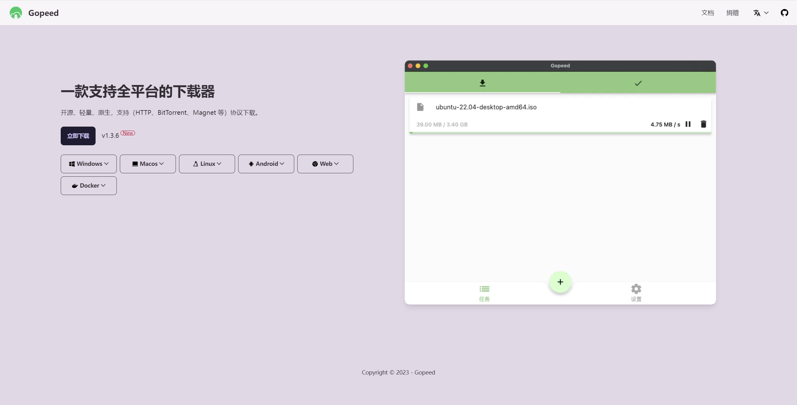
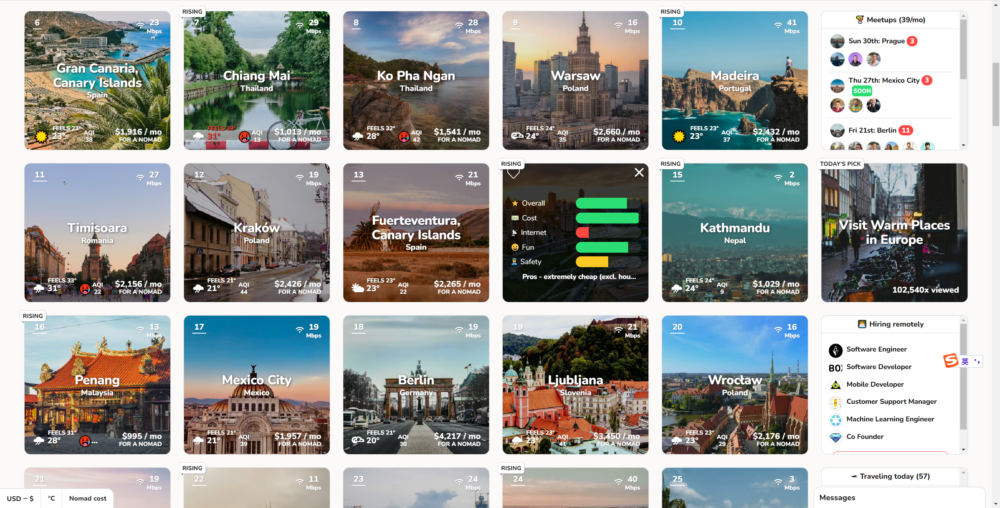

> 分享、实用、有趣、共勉

## 资料
英语学习资料
> 在线地址：[https://github.com/yujiangshui/A-Programmers-Guide-to-English](https://github.com/yujiangshui/A-Programmers-Guide-to-English)
> 
> 13000 Star，Github 最多人收藏的英语学习资料 
> 语言学习的本质浅析 
> 如何构建一个识别英语的程序 
> 我的训练方法 
> 常见问题 QA 
> 资料、工具推荐和扩展阅读

> 在线地址：[https://bewaters.me/limxtop/2021/08/18/English-introduction/](https://bewaters.me/limxtop/2021/08/18/English-introduction/)
> 
> 探索英语自学指南，全面提升语言能力！
>  基本学习方法、实践技巧、写作、听力和口语，应有尽有
>  初学者或进阶者，都能受益匪浅
>  开启自主学习，掌握英语关键要素！

## 工具

两个查源站IP有没有泄露的网站：
> 在线地址：[https://search.censys.io/search?resource=hosts](https://search.censys.io/search?resource=hosts)> 在线地址：[https://en.fofa.info/](https://en.fofa.info/)

Office & WPS 插件汇总
>在线地址：[https://www.aliyundrive.com/s/uVxLQcNmVVA](https://www.aliyundrive.com/s/uVxLQcNmVVA)  
>
	[https://pan.quark.cn/s/0a7c67ff3b70](https://pan.quark.cn/s/0a7c67ff3b70)  
	[https://pan.baidu.com/s/1haA3R_ZLx7WvGauxB8frpw?pwd=zapu](https://pan.baidu.com/s/1haA3R_ZLx7WvGauxB8frpw?pwd=zapu) 提取码: zapu

百度云通过变速精灵加速
> 百度云通过变速精灵加速，跑满带宽。 
> 
> 1.打开百度网盘客户端，选择文件开始下载 
> 
> 2.打开ce加速精灵，选择百度网盘进程，调速
> 
> 在线地址：[https://www.aliyundrive.com/s/FKnHUmuZfRo](https://www.aliyundrive.com/s/FKnHUmuZfRo)

Gopeed 一款支持全平台的下载器
> 在线地址：[https://gopeed.com/zh-CN](https://gopeed.com/zh-CN)

Final2x 图片放大工具
> 在线地址：[https://github.com/Tohrusky/Final2x/](https://github.com/Tohrusky/Final2x/)

视频压缩神器
>在线地址：[https://handbrake.fr/](https://handbrake.fr/)

Optimizer 堪称是 Windows 系统上最好用的性能优化器！
>在线地址：[https://github.com/hellzerg/optimizer](https://github.com/hellzerg/optimizer)

memreduct 内存自动优化清理
> 在线地址：[https://github.com/henrypp/memreduct](https://github.com/henrypp/memreduct)

## AI

AI图标集
> 在线地址：[https://www.bardeen.ai/blog](https://www.bardeen.ai/blog)
> 
>  https://www.bardeen.ai/posts/ultimate-ai-automation-guide#2

 📝AI文本

> ChatGPT： [https://chat.openai.com/](https://chat.openai.com/)  
> NotionAI： [https://www.notion.so/product/ai](https://www.notion.so/product/ai)  
> A.I. Data Sidekick：AI工具编写 SQL、文档等的速度提高10倍  
> [https://www.airops.com/](https://www.airops.com/)  
> Writesonic：人工智能写作辅助工具  
> [https://writesonic.com/](https://writesonic.com/)  
> copy.ai：使用 AI 编写更好的营销文案和内容  
> [https://www.copy.ai/](https://www.copy.ai/)  
> Character.AI：AI人工交互  
> [https://beta.character.ai/](https://beta.character.ai/)  
> Fireflies：该工具可插入 Zoom、Teams 或 Webex 等流行的视频会议工具，并自动执行做笔记和创建转录的过程  
> [https://fireflies.ai/](https://fireflies.ai/)  
> Jasper： AI文案写作工具  
> [https://www.jasper.ai/](https://www.jasper.ai/)  
> Outplay： [https://outplayhq.com/](https://outplayhq.com/)  
> CoWriter：AI辅助写作  
> [https://cowriter.org/login](https://cowriter.org/login)

### 🎨AI绘画

Midjourney：AI绘画神器  
> 网站： [https://www.midjourney.com/](https://www.midjourney.com/)  
> 教程： [https://www.uisdc.com/midjourney](https://www.uisdc.com/midjourney)  
> 
> PhotoRoom：擦除任何背景、对象  
> [https://www.photoroom.com/](https://www.photoroom.com/)  
> 
> 造梦师：只需一句话，让你的文字变成画作  
> [https://printidea.art/](https://printidea.art/)  
> 
> ARC Lab：一款提供照片修复、抠图、画质增强的在线工具  
> [https://arc.tencent.com/zh/ai-demos/faceRestoration](https://arc.tencent.com/zh/ai-demos/faceRestoration)  
> 
> Artbreeder：人工智能合成创意工具  
> [https://www.artbreeder.com/](https://www.artbreeder.com/)  
> 
> Stockimg AI：生成各种各样的设计元素,包括logo、插画、图片壁纸等  
> [https://stockimg.ai/](https://stockimg.ai/)  
> 
> niji·journey：二次元ai绘画  
> [https://nijijourney.com/zh/](https://nijijourney.com/zh/)  
> 
> Getimg.ai：关键词生成图片的AI工具  
> [https://getimg.ai/](https://getimg.ai/)  
> 
> Dreamlike.art：AI图像生成  
> [https://dreamlike.art/](https://dreamlike.art/)  
> 
> 文心一格 飞桨：AI艺术和创意辅助平台  
> [https://yige.baidu.com/](https://yige.baidu.com/)  
> 
> Phygital+：AI图像生成  
> [https://phygital.plus/](https://phygital.plus/)  
> 
> Beautiful.ai：AI生成PPT  
> [https://www.beautiful.ai/](https://www.beautiful.ai/)

### 🎶AI音频

> Brain.fm：专注、放松、冥想和睡眠，聆听为您的大脑量身打造的音乐  
> [https://www.brain.fm/](https://www.brain.fm/)  
> 
> Soundraw：人工智障生成音乐  
> [https://soundraw.io/](https://soundraw.io/)  
> 
> Endel：个性化背景音，帮助您集中注意力、放松和睡眠  
> [https://endel.io/](https://endel.io/)  
> 
> Riffusion：实时音乐和音频生成库  
> [https://www.riffusion.com/](https://www.riffusion.com/)  
> [https://github.com/riffusion/riffusion](https://github.com/riffusion/riffusion)  
> 
> Papercup：人工智障配音和视频翻译软件  
> [https://www.papercup.com/](https://www.papercup.com/)  
> 
> LALAL.AI：从任何音频和视频中提取人声、伴奏和各种乐器  
> [https://www.lalal.ai/](https://www.lalal.ai/)  
> 
> Murf：使用多功能AI语音生成器从文本到语音  
> [https://murf.ai/](https://murf.ai/)  
> 
> PolyAI：语音助手  
> [https://poly.ai/](https://poly.ai/)  
> 
> Voicemod：语音实时变声器  
> [https://www.voicemod.net/zh/](https://www.voicemod.net/zh/)  
> 
> Boomy：人工智障生成音乐  
> [https://boomy.com/](https://boomy.com/)  
> 
> Mubert：人工智障生成音乐  
> [https://mubert.com/](https://mubert.com/)

### 🎞AI视频

> Runway： AI 魔法工具  
> [https://runwayml.com/](https://runwayml.com/)  
> 
> Cascadeur：人工智障辅助关键帧动画软件  
> [https://cascadeur.com/](https://cascadeur.com/)  
> 
> Synthesia：人工智障视频生成  
> [https://www.synthesia.io/](https://www.synthesia.io/)  
> 
> Pollinations：文本转视频、图片  
> [https://pollinations.ai/](https://pollinations.ai/)  
> 
> Zubtitle：为视频添加字幕和在线编辑视频  
> [https://zubtitle.com/](https://zubtitle.com/)  
> 
> Munch：人工智障提取视频中的最引人入胜、最流行和最有影响力的片段  
> [https://www.getmunch.com/](https://www.getmunch.com/)  
> 
> Fliki：将文本变成带有 AI 语音的视频  
> [https://fliki.ai/](https://fliki.ai/)  
> 
> Peech：个性化的自动视频编辑和管理平台  
> [https://www.peech-ai.com/](https://www.peech-ai.com/)  
> 
> DreamFace：AI 动画照片应用程序  
> [https://dreamfaceapp.com/](https://dreamfaceapp.com/)  
> 
> D-ID：人工智障视频生成  
    [https://www.d-id.com/](https://www.d-id.com/)

> 上文参考：[AI 工具合集](https://tmioe.com/7665.html)

## 扩展

###  数字游民宜居地
> 在线地址：[https://nomadlist.com/](https://nomadlist.com/)
> 
> 数字游民宜居地 网站「Nomad List」，收集和展示了数千个城市的数字游民指数，包括成本、网络速度、生活质量等，你可以探索到一个最适合工作和生活的地方，并与社区里的同学交流经验和建议，网站本身做得也很不错，收藏备用一下。

