> 分享、实用、有趣、共勉

## 思维
重新认识前端
> 在线地址：[重新理解Web](https://zhuanlan.zhihu.com/p/581977751)

不错的博客
> 在线地址：[https://imageslr.com/](https://imageslr.com/)
> 
> 值得学习的方法论

## AI
深言达意
> 在线地址：[https://shenyandayi.com/](https://shenyandayi.com/)
> 
> 清华出品，它可以帮助你更好的表达，尤其是当你想不到合适的词语时。输入描述就可以得到结果，包括古诗文、对联、现代用语等。

ForeFront —— 免费用 GPT-4、Claude+ 
> 在线地址：[https://chat.forefront.ai](https://chat.forefront.ai) 
> 
> 免费用户每 3 小时可以免费问 5次 GPT-4 或 Claude+。GPT-3 和 Claude Instant 免费用无限制。

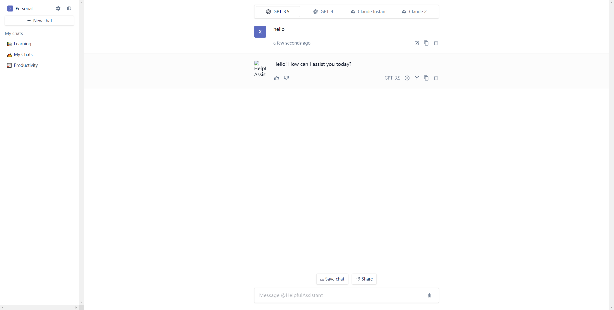

AL进行搜索
> 在线地址：[https://www.perplexity.ai/](https://www.perplexity.ai/)
> 用AI替换Google以节省数小时的方法

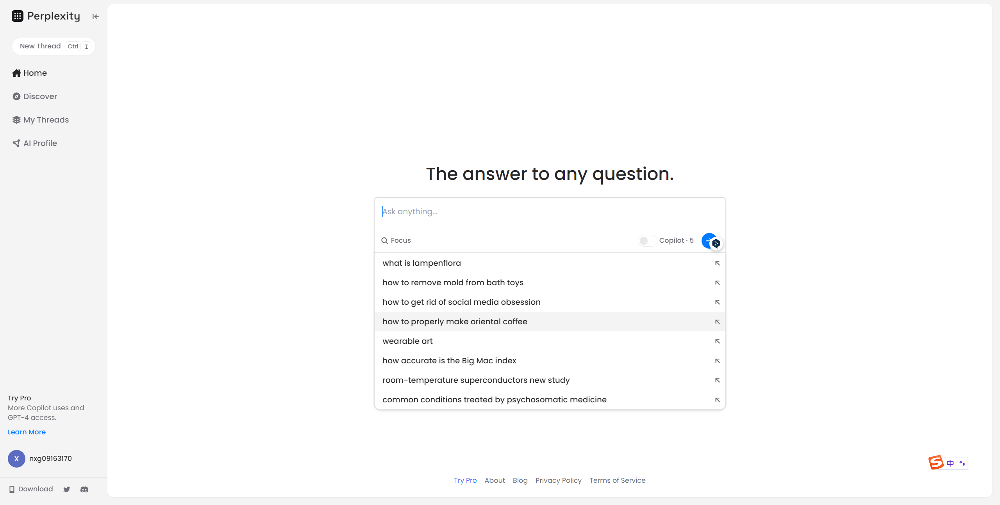

## 资源
自学计算机科学与技术
>在线地址：[https://github.com/izackwu/TeachYourselfCS-CN/blob/master/TeachYourselfCS-CN.md](https://github.com/izackwu/TeachYourselfCS-CN/blob/master/TeachYourselfCS-CN.md)
>
> 自学计算机科学，开发者的福音！ 能省下万八千学费，持续更新的中文学习资源 探索编程世界，提升技能，开启新篇章！

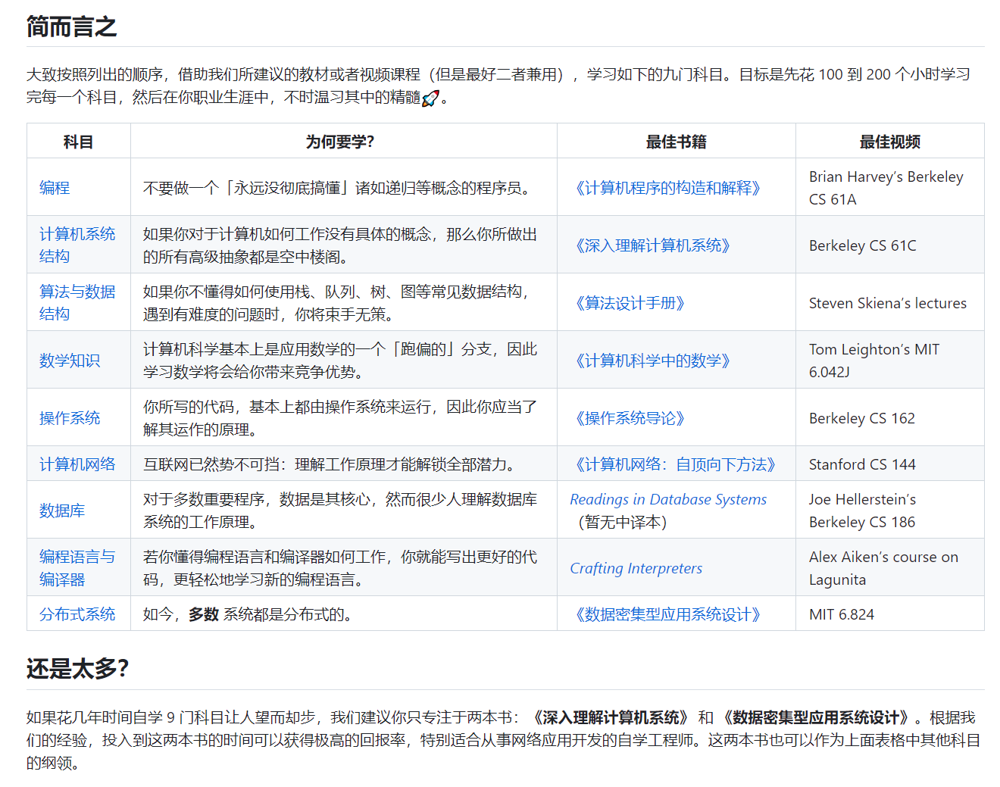

ENPUZ —— 英语长句可视化语法分析
> 在线地址：[http://enpuz.com/](http://enpuz.com/)
> 
> Enpuz 全称 English Puzzle，提供众多英语学习工具。最具特色的是基于 AI 的英语长句可视化语法分析。但目前句子长度受限。

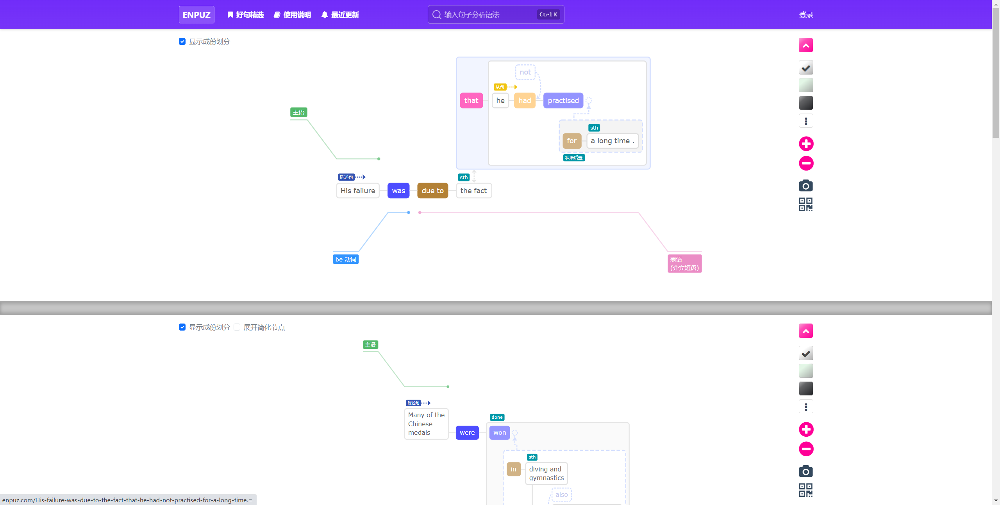

LineageOS
> 在线地址：[https://download.lineageos.org/changes](https://download.lineageos.org/changes)
> 
> 刷机ROM包资源查找

## 工具

### 在线免费字幕编辑器
> 项目地址：[https://github.com/zhw2590582](https://github.com/zhw2590582)
> 
> 在线地址：[https://aimu.app/](https://aimu.app/)

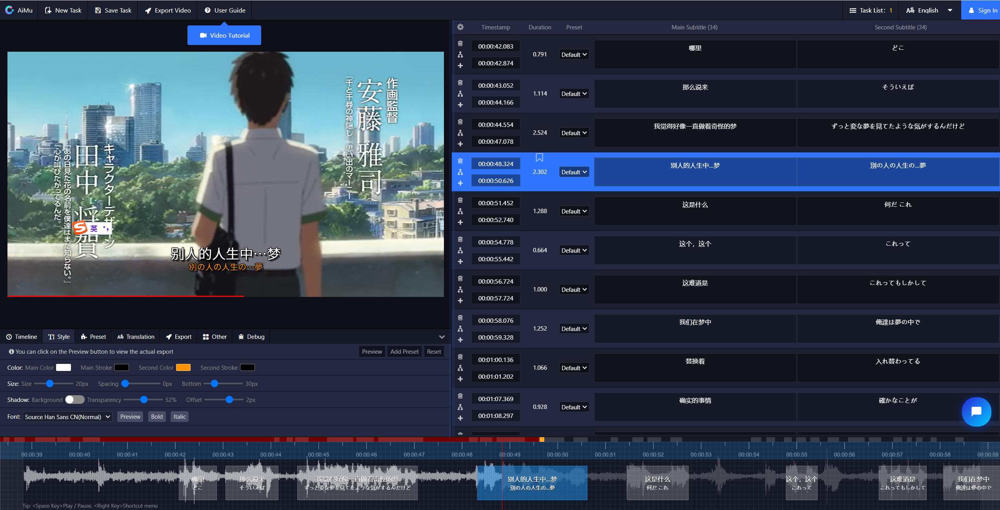

AI智能字幕生成软件
> 在线地址：[http://www.aizimuji.com/](http://www.aizimuji.com/)
> 
> AI智能字幕生成软件 任意音频， 视频转换为各种语言的字幕 一键生成字幕 无需配置 无需手动调整 分为专业版和免费版本

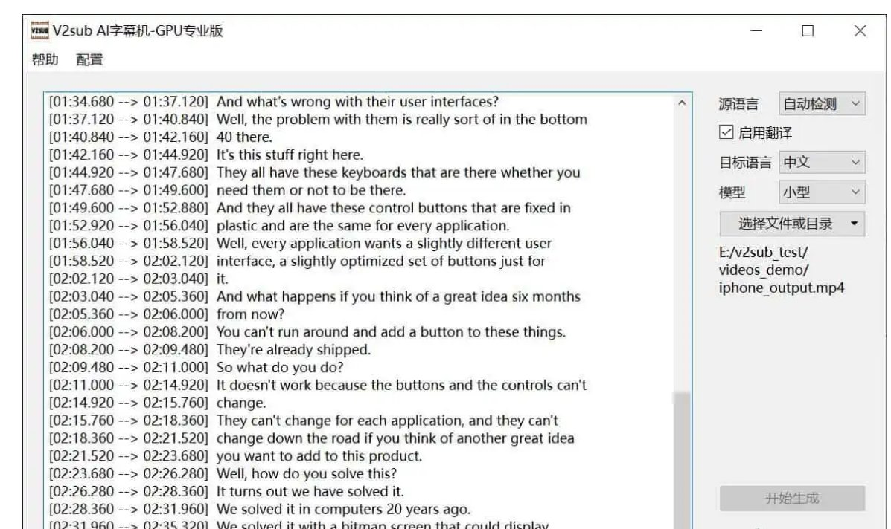

Mobile Phone Museum —— 手机博物馆 
> 在线地址：[https://mobilephonemuseum.com](https://mobilephonemuseum.com) 
> 
> 这个网站收集了从 1980 年到如今的 2400 多款手机的照片和参数。

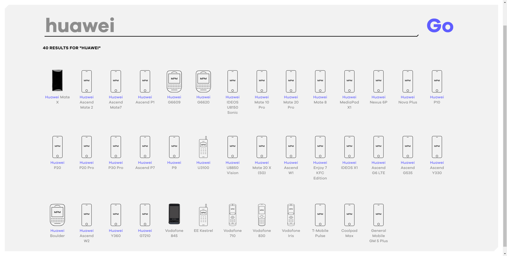

网络视频通话工具

> 在线地址：[https://tlk.li/](https://tlk.li/)
> 
> 找到一个免费、点对点、开源的网络视频通话工具「Talk」，不需要注册，也不需要下载软件，直接生成一个随机房间地址，对应的人点击链接进来就可开始，也可以根据 Github 源码自己部署一套会很方便。

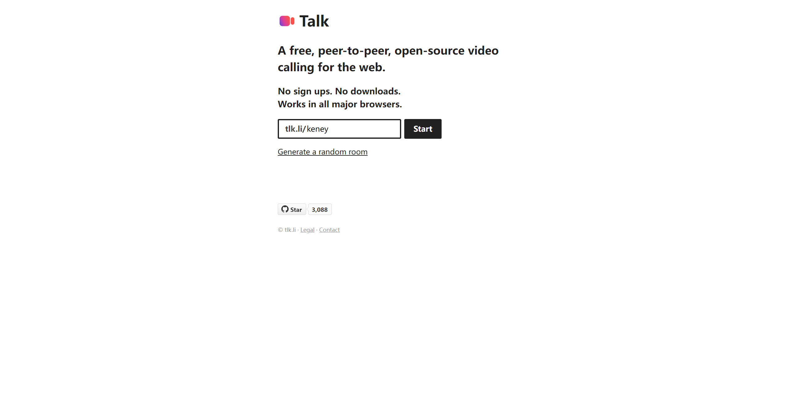

## 设计
Ghost —— 设计图转骨架屏的 Figma 插件
> 在线地址：[https://www.figma.com/community/plugin/1017135840453013129/Ghost](https://www.figma.com/community/plugin/1017135840453013129/Ghost)
> 
> 该插件可以把高保真的设计稿转换成骨架屏，用来做加载的过度动画，或者当线框图放在作品集里提高档次。Ghost —— 设计图转骨架屏的 Figma 插件

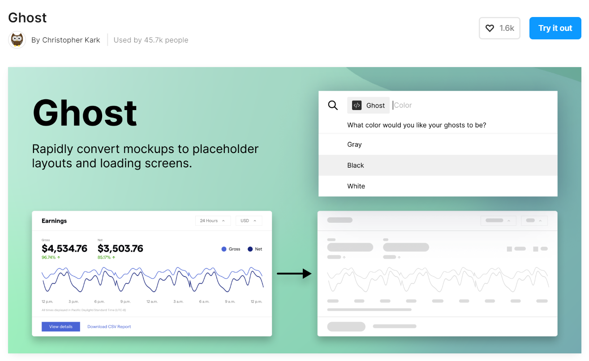

VectorizerAI —— AI 位图转矢量 
> 在线地址：[https://vectorizer.ai](https://vectorizer.ai) 
> 
> 利用人工智能将 JPG、PNG 等位图转成矢量 SVG 格式。先用 MidJourney 生成插图，再用这个工具转成矢量略加修改，岂不美哉。

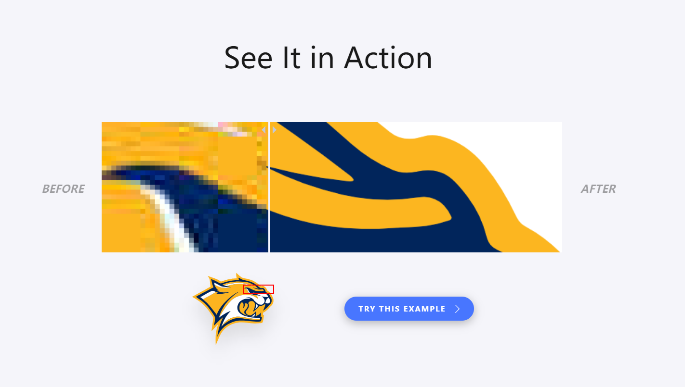

AI Colors —— 人工智能配色 
> 在线地址：[https://aicolors.co](https://aicolors.co) 
> 
> 输入提示词，用人工智能生成界面配色方案，提供 App、仪表盘、落地页、作品集等页面模板实时预览配色效果。

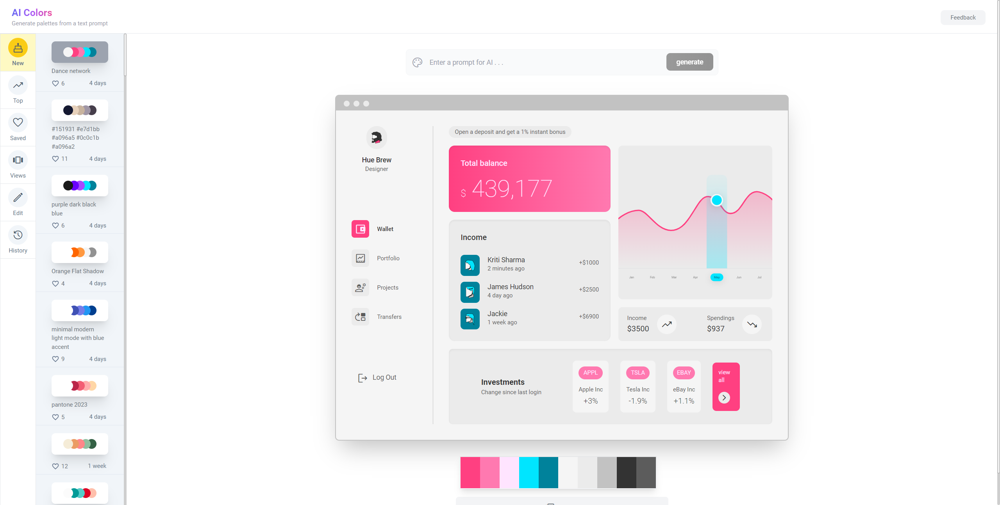

3D icon —— Figma 制作的毛玻璃立体图标 
> 链接：[https://www.figma.com/community/file/1263047704184807700/3D-icon](https://www.figma.com/community/file/1263047704184807700/3D-icon) 
> 
> 没有用 C4D 纯在 Figma 里绘制的 3D Icon，除了源文件 B 站还有视频教程，用到了easometric 和 oblique 这两个插件。

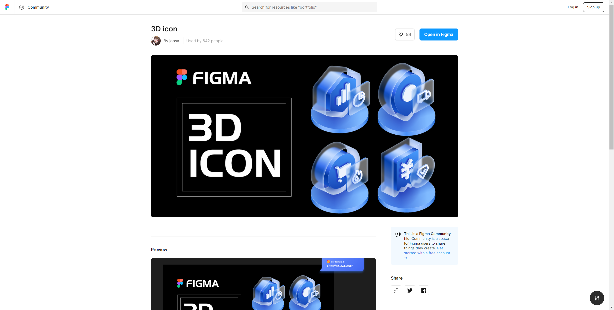

Icon Buddy —— 图标搜索下载 
> 在线地址：[https://iconbuddy.app/svg-icons](https://iconbuddy.app/svg-icons) 
> 
> 聚合了 120 多个图标库，收集了超过 10 万个图标，下载前还能对颜色、粗细、背景进行定制。

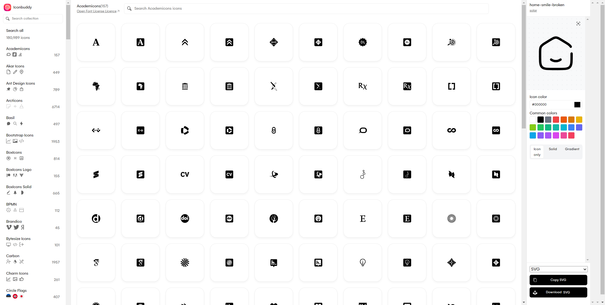

Iconhunt —— 图标搜索引擎 
> 在线地址：[https://iconhunt.site](https://iconhunt.site) 
> 
> 共收录了 15 多万个免费图标供搜索，除了下载 SVG 格式文件，还可以直接粘贴在 Notion 或 Figma 里。

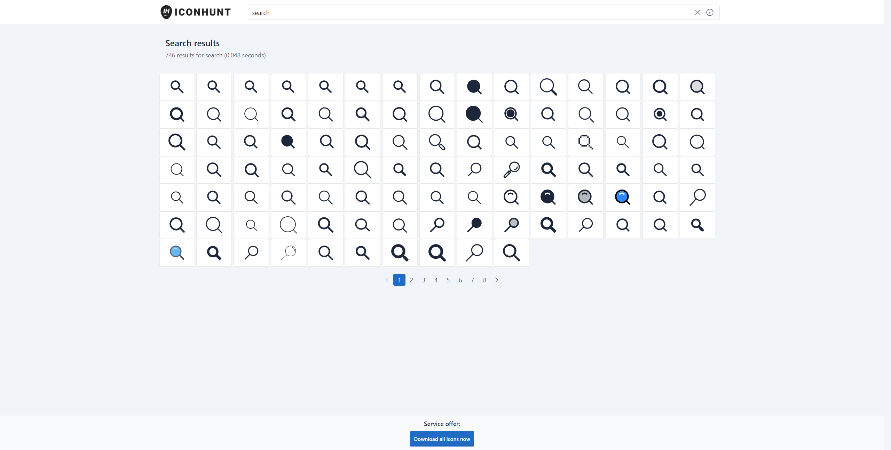

找字体——免费商用中文字体 
> 在线地址：[https://zfont.cn](https://zfont.cn) 
> 
> 已收录 550 款免费商用中文字体，网站底部还有免费的视频音效、图片、矢量图网站导航。

辰宇落雁體 —— 开源可商用手写字体 
> 在线地址：[https://github.com/Chenyu-otf/chenyuluoyan_thin](https://github.com/Chenyu-otf/chenyuluoyan_thin) 
> 
> 这是由两位台湾高中生王立宇和劉韋辰合伙创造的字体。字体命名也是取自创作者名字各一个字已沉鱼落雁的谐音而来。

