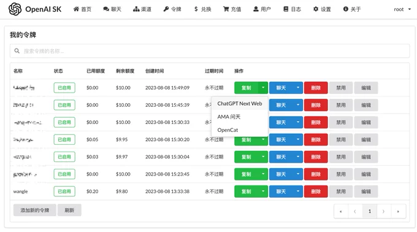

> 分享、实用、有趣、共勉

## 在线工具

画图工具：[https://handraw.top/](https://handraw.top/)

> 项目地址：[https://github.com/korbinzhao/excalidraw-cn](https://github.com/korbinzhao/excalidraw-cn)
> 
> 可画流程图、打草稿等

## 资料

《TypeScript 教程》

> 在线地址：[https://www.ruanyifeng.com/blog/2023/08/typescript-tutorial.html](https://www.ruanyifeng.com/blog/2023/08/typescript-tutorial.html)
> 
> github仓库：[https://github.com/wangdoc/typescript-tutorial](https://github.com/wangdoc/typescript-tutorial)
> 
> 阅读地址：[https://wangdoc.com/typescript/](https://wangdoc.com/typescript/)
> 
> 网道包含有HTML、JS、ES6、WebAPI等

书单导航

> 在线地址：[https://box123.io/sites/1142.html](https://box123.io/sites/1142.html)
> 
> 什么值得读（[shenmezhidedu.com](https://shenmezhidedu.com/)）是一个提供各种书籍推荐的网站。网站上有各种类型的书籍，包括小说、理财、名人传记、个人成长、心理、增长黑客、设计、产品经理和运营等。

电子书籍下载

> 1、鸠摩搜书：[http://jiumodiary.com](http://jiumodiary.com) 
> 这个还是能找到不少书籍的 
> 
> 2、无名图书：[http://book123.info](http://book123.info) 电子书搜索下载网站，有上万本书籍，提供pdf、epub等格式，免费、无需注册登录，直接就能下载 
> 
> 3、莫若书单：[http://mrsd.top](http://mrsd.top) 以pdf、epub格式为主，数量丰富，可以直接下载 
> 
> 4、Project Gutenberg：[http://gutenberg.org](http://gutenberg.org) 收集了超过70000本电子书，所有书籍均为志愿者分享 
> 
> 5、ManyBooks：[http://manybooks.net](http://manybooks.net) 收集了50000多本电子书，并提供多种格式供用户下载 
> 
> 6、Forgotten Books：[http://forgottenbooks.com](http://forgottenbooks.com) 目前已有129多万册外文书籍，涵盖多个领域，可在线阅读或下载 
> 
> 7、PDFDrive：[http://pdfdrive.com](http://pdfdrive.com) 提供8400多万本电子书籍，其中有不少中文书籍，无下载限制 
> 
> 8、Planet eBook：[http://forgottenbooks.com](http://forgottenbooks.com) 主要提供古典文学著作，可以在线阅读或下载 
> 
> 9、Loyal Books：[http://loyalbooks.com](http://loyalbooks.com) 提供了7000多书籍供用户下载，包括有声书和电子书！主要有儿童读物、小说、诗歌、历史等！都是免费的 
> 
> 10、Freebookcentre：[http://freebookcentre.net](http://freebookcentre.net) 免费下载数千本技术类书籍，包括计算机科学、编程语言、物理学、医学、化学、数学、商业金融等种类 
> 
> 11、搬书匠：[http://banshujiang.cn](http://banshujiang.cn) 提供编程开发类书籍，免费下载 
> 
> 12、SaltTiger：[http://salttiger.com](http://salttiger.com) 编程类书籍下载网站，数量挺丰富

经济学人、纽约客等英语外刊杂志

> 在线地址：[https://github.com/hehonghui/awesome-english-ebooks](https://github.com/hehonghui/awesome-english-ebooks)
> 
> 经济学人、纽约客、自然、新科学人、卫报、科学美国人、连线、大西洋月刊、国家地理等杂志的免费下载和订阅（支持kindle推送）
> 
> 并且每周都有更新 GitHub 6000 星
> 
> -   经济学人 – 周刊, 点击这里下载最新一期 , 每周五十一点更新
> -   纽约客 – 周刊, 点击这里下载最新一期 , 每周六上午更新
> -   卫报 – 每周两期, 每周三、周日更新
> -   The Atlantic – 月刊, 每月2号更新
> -   Wired – 月刊, 每月2号更新

## AI

绘画利器

> 在线地址：[https://www.whee.com/](https://www.whee.com/)

OpenAI Key 分发管理

> 在线地址：[https://github.com/songquanpeng/one-api](https://github.com/songquanpeng/one-api)
> 
> 直接把自己OpenAI账号下的API Key分享给别人又担心被滥用误用，用它搭建了一个OpenAI接口代理&API Key二次分发系统，再搭配Chatbot-UI和ChatGPT-Next-Web使用

Merlin
> 在线地址：[https://merlin.foyer.work/](https://merlin.foyer.work/)
> Merlin是一款免费的终极 AI 工具：
> 
> 使用Merlin上的聊天GPT在Gmail上的瞬间写邮件或回复邮件；
> 
> 在Twitter上，您可以使用Merlin生成独具一格的推文；
> 
> Merlin可以在几秒钟内摘要任何文章、博客、文章、文档等，并为您提供要点；
> 
> 使用Merlin快速摘要任何YouTube视频；
> 
> Merlin AI Chatbot中的WebChat功能允许您使用ChatGPT摘要或与任何网站聊天；
> 
> Merlin可帮助您在LinkedIn上创建独特的职位帖子、摘要、描述和消息；
> 
> 使用Merlin，您可以与网站交流或摘要信息；
> 
> Merlin为您提供免费访问ChatGPT，它具有GPT-4的高级功能；
> 
> 使用Merlin AI Chatbot，您可以使用ChatGPT与任何PDF或文档聊天，或使用DocChat获得准确的摘要；
> 
> Merlin使用具有互联网访问的ChatGPT，为您提供最新和相关的答案；

## 扩展
Chrome 浏览器运行原理
> 在线地址：[https://mp.weixin.qq.com/s/wjrcO2Ej7BEThWVsCnXEtA](https://mp.weixin.qq.com/s/wjrcO2Ej7BEThWVsCnXEtA)
> 

## Github推荐

> 在线地址：[JasonkayZK (Jasonkay) (github.com)](https://github.com/JasonkayZK)

> 在线地址：[https://github.com/zkeq](https://github.com/zkeq)
> 
> 博客地址：[https://icodeq.com/](https://icodeq.com/)
> 
> API、Code、Action

