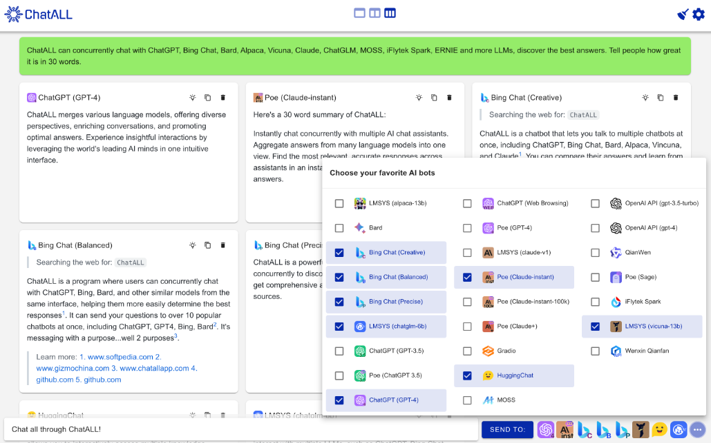
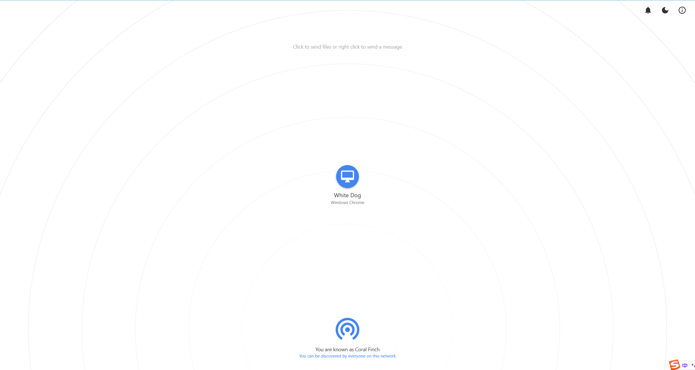
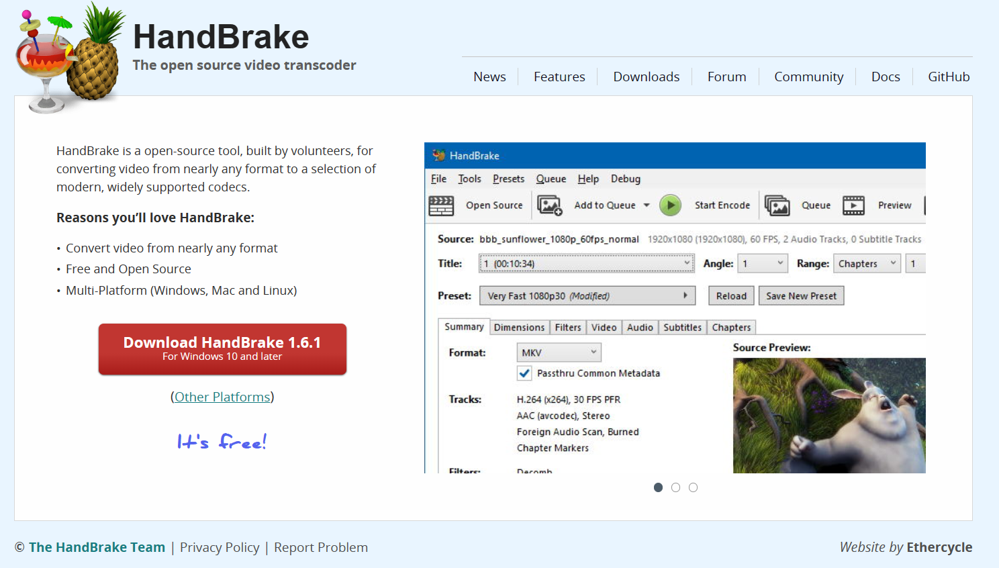

> 2023-06-17

## AI

> chatgpt 镜像：[https://chat.wuguokai.cn/](https://chat.wuguokai.cn/)

### Pandora-Vercel

> 项目地址：[https://github.com/AngelOver/pandora-vercel](https://github.com/AngelOver/pandora-vercel)
> 
> 在线地址：[pandora-vercel-mauve.vercel.app](https://pandora-vercel-mauve.vercel.app/ "https://pandora-vercel-mauve.vercel.app")
> 
> https://pandora-vercel-mauve.vercel.app/auth/login

> 在线案例：
>1. [照夜清的AI小宇宙 — ChatGPT 网站！](http://chatgpt-site.zhaoyeqing.cn/#/home)
>2. [共享ChatGPT账号-we端直接使用](https://chat-shared2.zhile.io/)
> 

### new bing镜像：

> 项目地址：[用 Vue3 和 Go 搭建的微软 New Bing 演示站点，拥有一致的 UI 体验，支持 ChatGPT 提示词，国内可用](https://github.com/adams549659584/go-proxy-bingai)
> 
   在线地址：[BingAI - 聊天 (vcanbb.top)](https://bing.vcanbb.top/web/#/)
> 
> 使用教程：[Docs (feishu.cn)](https://pinqmsof0xj.feishu.cn/docx/QL4vd0kdhoB3nIx44x4cQDN3nKf)

### ChatAll

>  项目地址：[sunner/ChatAll](https://github.com/sunner/ChatALL)
>  
>  支持：Concurrently chat with ChatGPT, Bing Chat, Bard, Alpaca, Vicuna, Claude, ChatGLM, MOSS, 讯飞星火, 文心一言 and more, discover the best answers 
>  
>  多个大型语言模型（LLMs）的 AI 机器人

### ChatGPT+Midjourney 

ChatGPT-Midjourney:  ChatGPT+Midjourney 网页应用

>项目地址: https://github.com/Licoy/ChatGPT-Midjourney
>
> 一键免费部署你的私人 ChatGPT+Midjourney 网页应用。集成了ChatGPT的网页聊天+Midjourney的图片生成服务。

### FlowGPT
> 项目地址：[https://flowgpt.com/](https://flowgpt.com/)
> 
> Prompt 集合社区

## 局域网

局域网文件传输文件：

> 在线地址：[https://snapdrop.net/](https://snapdrop.net/)

其他工具：

> localsend : https://localsend.org/
> 
>  传输速度比较慢
>  
>  飞秋：[http://www.feiq18.com/](http://www.feiq18.com/)

HandBrake 视频格式处理工具

> 在线地址：[https://handbrake.fr/](https://handbrake.fr/)
> 
> 「免费开源的视频格式万能处理工具HandBrake」，可以几乎将视频从任何格式转换为主流平台的视频格式，并压缩到合适的大小，做得挺好的，很方便。

## 学习
### go-demo
> 项目地址：[https://github.com/pibigstar/go-demo](https://github.com/pibigstar/go-demo)
> 
> Go语言实例教程从入门到进阶，包括基础库使用、设计模式、面试易错点、工具类、对接第三方等。

### BoxCoding
> 项目地址：[https://avabucks.it/index](https://avabucks.it/index)
> 
> 前端初学者的工具网站「BoxCoding」，有不少使用原生HTML/CSS/JavaScript实现的常用效果，做得很精致，同时代码实现挺不错，也适合突然想找某个 Ui 的实现场景。

### 正则表达式

> 项目地址：[https://regex101.com](https://regex101.com)
> 
> 写正则表达式

## 扩展

### Docker-OSX
> 项目地址：[https://github.com/sickcodes/Docker-OSX](https://github.com/sickcodes/Docker-OSX)
> 
> 一个运行 macOS 虚拟机的 Docker 镜像。

### PLExtension: 一个图床上传浏览器扩展

> 项目地址：[https://github.com/ZenEcho/PLExtension](https://github.com/ZenEcho/PLExtension)
> 
> 一款免费的上传扩展程序提供兰空图床,简单图床,chevereto,阿里云oss,AWS S3,GitHub等程序的文件上传。开源代码，支持粘贴、拖拽、右键上传。

### Progress-一个命令行工具
> 项目地址：[https://github.com/Xfennec/progress](https://github.com/Xfennec/progress)
> 
> Progress 可以显示当前一些耗时操作的进度，比如 大文件的 cp/mv/dd,  甚至还可以显示下载进度等等。它还提供了一个类似 top 的界面，可以全面监控各种进度。

### 黑苹果 折腾指南

> 现在有 #OpenCore 保驾护航，即使 #macOS 大版本更新也无忧，如今技术不断进步， #Github 上有他人分享的EFI，购买硬件和组装变得更加简单。分享几个黑果技术网站，组装出自己的黑苹果电脑。

-   OpenCore 中文安装指南：[https://sumingyd.github.io/OpenCore-Install-Guide/](https://sumingyd.github.io/OpenCore-Install-Guide/)
    
-   黑果小兵：[https://blog.daliansky.net/](https://blog.daliansky.net/)
    
-   远景论坛：[https://bbs.pcbeta.com/forum.php?gid=86](https://bbs.pcbeta.com/forum.php?gid=86)
    
-   国光OpenCore配置教程：[https://apple.sqlsec.com/](https://apple.sqlsec.com/)
    
-   Github搜索EFI：[https://github.com/search?q=EFI](https://github.com/search?q=EFI)
    
-   Github搜索Hackintosh：[https://github.com/search?q=Hackintosh](https://github.com/search?q=Hackintosh)
    
-   GeQ1an的EFI：[https://github.com/GeQ1an/MSI-B360M-MORTAR-HACKINTOSH-OPENCORE-EFI](https://github.com/GeQ1an/MSI-B360M-MORTAR-HACKINTOSH-OPENCORE-EFI)

## 项目推荐 

> 开发设计资源

https://github.com/bradtraversy/design-resources-for-developers

> 五十个项目

https://github.com/bradtraversy/50projects50days