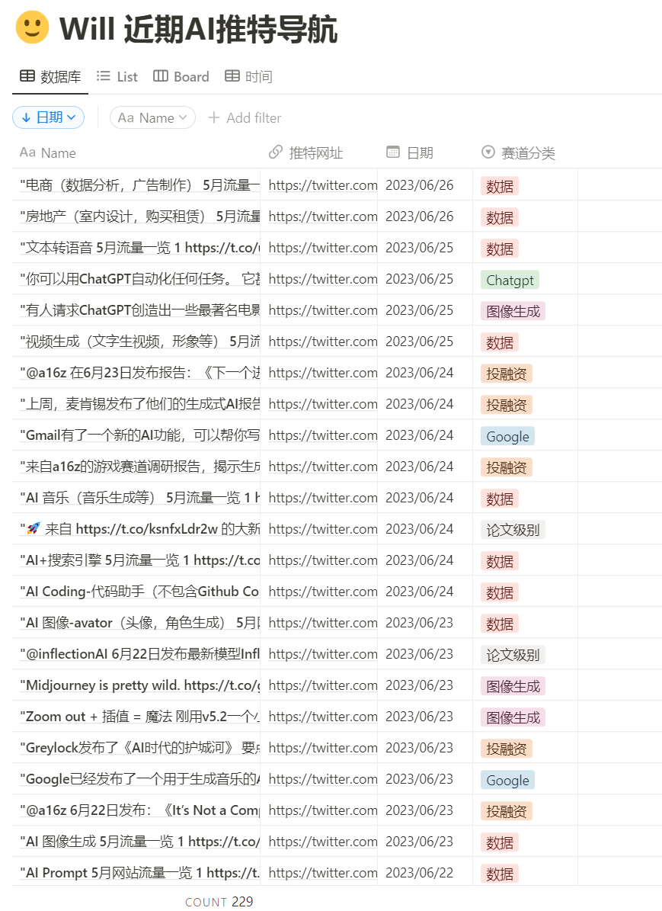

## 在线测速和IP查询

> 在线测速和IP查询网站
> 1、[https://speed.cloudflare.com](https://t.co/epe8BBtlnZ) 
> 
> 2、[https://fast.com](https://t.co/nKRHPUstae)
> 
> 3、[https://speedtest.net](https://t.co/XejLWHx6u3) 
> 
> 4、[https://ip.skk.moe](https://t.co/XIBj3rlnVo) 
> 
> 5、[https://ip.sb](https://t.co/LB8AY7mAYI)
> 
> 6、 [http://ping.sx](https://t.co/ArgCSABffB) 
> 
> 		可以全球 ping ip，查看全球延迟情况、是否只有中国地区不可访问该 ip。
> 		
> 7、[https://ping.pe](https://t.co/NcLs2IqDU1)
> 		搬瓦工
> 		
> 8、 [http://ident.me](https://t.co/tOBh847vH4)
> 
> 9、[http://test.ustc.edu.cn](https://t.co/1b605cLdCq)
> 
> 10、 [http://speed.neu6.edu.cn](https://t.co/WwtIujWP0W)
> 
> 11、 [https://ping.huatuo.qq.com](https://t.co/8YOxbjZuce)
> 
> 12、 [http://test-ipv6.com](https://t.co/cjJZV46sF8)
> 
> 13、 [http://ip6.me](https://t.co/qtV3Ero4iY)

## 资料检索平台

 ### JavaScript 教程
 > 在线地址：[http://zh.javascript.info](https://zh.javascript.info/)
 > 
 它以最新的 JavaScript 标准为基准，通过简单但足够详细的内容，讲解从基础到高阶的 JavaScript 

> 在线地址： [http://tutorialspoint.com](https://t.co/VDe82asxzI) 
> 
   这是一个将编程入门难度降低至脚踝之下的学习平台，上面有一些又好玩又简单的教程，你可以在这里上学习找到几乎所有语言框架，甚至还有区块链相关的教程!

### AI-For-Beginners

> 在线地址：[https://github.com/microsoft/AI-For-Beginners](https://github.com/microsoft/AI-For-Beginners)
> 
> 微软的「AI-For-Beginners」学习文档适合初学者，它从历史、基础知识、框架、计算机视觉和自然语言处理等方面讲解人工智能的原理概念。它并没有涵盖当前主流的 ChatGPT 技术，但可以帮助你建立坚实的基础，并为进一步学习 ChatGPT 技术打下基础。

### Will 近期AI推特导航
> 在线地址：[Will 近期AI推特导航](https://three-recorder-52a.notion.site/9d4de6aa705244da815b9837bfd3fb49?v=854990d878814d528b4679edb1bbd38a)
> 生成式AI相关内容，查找不方便， 因此整理了Will的推特内容导航，共计80+内容 

## 扩展

浏览器录屏
>  Screenity在线地址：[alyssaxuu/screenity: 🎥 ](https://github.com/alyssaxuu/screenity)
>  
>  这是一个可以对浏览器 Tab 进行视频录制的 Chrome 插件， 它可以很方便地进行音视频的录制，过程中还可以像 PPT 一样做演示，也可以把自己给录进去，录制完成后支持对视频进行简单的裁剪和编辑。对演讲者十分友好。

> 在线地址：[https://lumaoaccount.com](https://lumaoaccount.com)
> 一个购买IP和三件套的渠道网站应该是全网最便宜了，IP10元，三件套2-3元，存量非常充足，IP稳定而且毕竟全

## 5 个阿里推出新 AI 工具网站

>1/ 堆友 - 3D 在线编辑器、正版素材平台 可免费商用，在线DIY，角度、颜色、材质轻松调整更换 不用安装软件，实时编辑实时渲染
>
>在线地址：[https://www.duiopen.com/](https://www.duiopen.com/)

> 2/ 绘剪 这个工具放在视频剪辑界，那是相当炸裂的存在了，特别是那种一个商品有多个视频剪辑需求的宝子，偷着乐吧。 直接输入某 猫宝商品! 就能帮助您自动化生成至少7~8个各种样式的短视频，并支持修改编辑。
> 
> 在线地址：[https://consumer.huawei.com/cn/offer/huawei-share/hiui/](https://consumer.huawei.com/cn/offer/huawei-share/hiui/)

> 3/ 犸良 需要做一些动态的弹窗、小图标、banner，不会用AE也不用担心，这个网站可以像PPT一样简单的可视化编辑的方式，让没有动效制作经验的你也能制作动效，只需要更改颜色和替换图片即可
> 
> 在线地址：[https://maliang.alibaba-inc.com/](https://maliang.alibaba-inc.com/)

> 4/ ChartCube 这个网站只需4步就能完成可视化图表制作：导入数据、选择图表类型、配置图表、导出 各种常用的折线图/柱状图/饼状图/雷达图/热力图等都有，不用注ce，在线免! 可用，支持png/jpg/svg等多种格式导出

> 5/ 顽兔抠图 这个网站在淘宝的后台，是阿里巴巴自主开发供卖家使用的抠图网站 进入卖家服务市场，搜索“顽兔”，免费购买，即可使用 支持本地上传 20 张图片同时处理，也可以自己手动加工，抠除的图片都可免存

## 项目推荐

>  项目地址：[https://github.com/austin2035/chatpdf](https://github.com/austin2035/chatpdf)
>  
>  通过私有 openai key，自由地与 PDF 对话。
>  
>  一些经典使用场景： 
>  1. 总结和分析论文、学术文章。 
>  2. 报告总结、分析和针对细节的提问。 
>  3. 回答任何 PDF 中的任何问题。

UltraLM 登顶斯坦福 Alpaca-Eval 开源模型榜单

> Github地址：[https://github.com/thunlp/UltraChat](https://github.com/thunlp/UltraChat)
> 
> Huggingface地址：[https://huggingface.co/openbmb/UltraLM-13b](https://huggingface.co/openbmb/UltraLM-13b)
> 
> 榜单地址： [https://tatsu-lab.github.io/alpaca_eval/](https://tatsu-lab.github.io/alpaca_eval/)
> 
> UltraLM-13B 是一个在 UltraChat 数据上训练而来的大语言模型，它具有丰富的世界知识和超强的指令理解和、知乎等机构在 OpenBMB 开源社区构建，这是一个大规模、高质量、高度多样化的多轮指令数据，包含了 150余万条 多轮指令数据。

