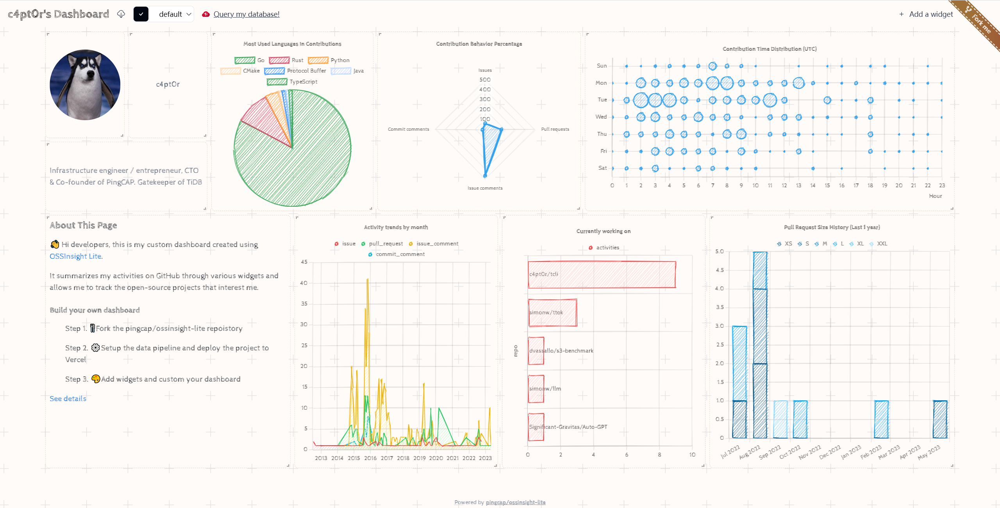
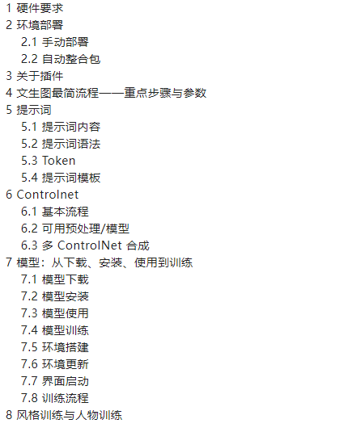

>github数据展示：[https://github.com/pingcap/ossinsight-lite](https://github.com/pingcap/ossinsight-lite)
>
>使用ossinsight-lite搭建的github主页信息展示表 图表组件都很酷! 
>
>在线地址： [https://oss-widgets.changwei.me](https://t.co/4SS2AK2aip)
>
>搭建在Vercel平台上，数据库用的是免费版的TiDB Cloud Serverless实例

> tidbcloud: https://tidbcloud.com/console/clusters
> 
> 数据存放在TiDB Cloud，tidbcloud的serverless可以当作一个免费的MySQL数据库来用（目前提供的使用额度足够那些对于数据访问不是很频繁的个人网站或小型业务使用了） 因为TiDB的协议完全兼容MySQL 5.7，所以只要是能用MySQL的地方基本上也都能用TiDB，包括像MySQL Workbench之类的也能用，还是挺方便的

## 工具

即时工具

> 在线地址：[https://www.67tool.com/](https://www.67tool.com/)
> 
> 即时工具。视频、音频、图片、文档、数据图表等功能应有尽有 完成视频剪切、录屏、音频提取等任务，还有图表制作和辅助小工具

短信接码平台工具
> 地址：[短信](http://5sim.net)
>
> 有 50 多万个来自 180 个国家的手机号码同时在线
> 
> 使用手机号码一次并重复接收短信 !
> 
> 支持服务有 OpenAI、ChatGPT、Paypal等

短信接码平台工具2
>  在线地址：[http://sms4u.vip](http://sms4u.vip) 
>  
> 在10到20分钟内，可以收到无限制数量的SMS，发送给俄罗斯联邦，哈萨克斯坦，吉尔吉斯斯  坦，波兰，罗马尼亚,美国...等国家

免费制作 PDF 
>在线地址：[http://ilovepdf.com](http://ilovepdf.com)
>

## 扩展

ChatGPT+Midjourney 网页服务
> 在线地址：[https://github.com/Licoy/ChatGPT-Midjourney](https://github.com/Licoy/ChatGPT-Midjourney)
> 🍭 一键拥有你自己的 ChatGPT+Midjourney 网页服务 | Own your own ChatGPT+Midjourney web service with one click

ChatGPT 探索：Code Interpreter 高级指南
> 地址：[https://mp.weixin.qq.com/s/K_csi1oWDv5tEaeeKSlvwA](https://mp.weixin.qq.com/s/K_csi1oWDv5tEaeeKSlvwA)

ChatGPT神器Code Interpreter 保姆级教程
> 在线地址：[https://bad.news/t/4986984](https://bad.news/t/4986984)
> ChatGPT神器Code Interpreter，

Stable Diffusion 保姆级入门手册
> 在线地址：[Stable Diffusion 保姆级入门手册](https://mp.weixin.qq.com/s/nhB7Hsjz_aLkSrUT0mqHWw)
> 
> AI的新手-Stable Diffusion 保姆级入门手册 从硬件要求 环境部署安装到参数配置 模型下载安装使用训练等等
   手把手教大家入门 Stable Diffusion

> 《ChatGPT 越过山丘之后，再来谈谈 LLM 应用方向》
> 
>   在线地址：[https://quail.ink/orange/p/chatgpt-cross-over-the-hills-and-discuss-llm-application-directions](https://quail.ink/orange/p/chatgpt-cross-over-the-hills-and-discuss-llm-application-directions)

> Notion 中文社区导航：[https://cnotion.notion.site/Notion-e18268991cd14de89b1cad0de60baa91](https://cnotion.notion.site/Notion-e18268991cd14de89b1cad0de60baa91)
> 
> Notion 学习快捷键：[https://cnotion.notion.site/f458700ee8564132a291f79fb96c02ee](https://cnotion.notion.site/f458700ee8564132a291f79fb96c02ee)

外语慕课平台
> 在线地址：[https://moocs.unipus.cn/](https://moocs.unipus.cn/)
> 
> 汇集了各大高校的优质外语课程，免费。 课程涵盖的语种包括：英语、日语、韩语、俄语、法语、德语、西班牙语、阿拉伯语、意大利语等。