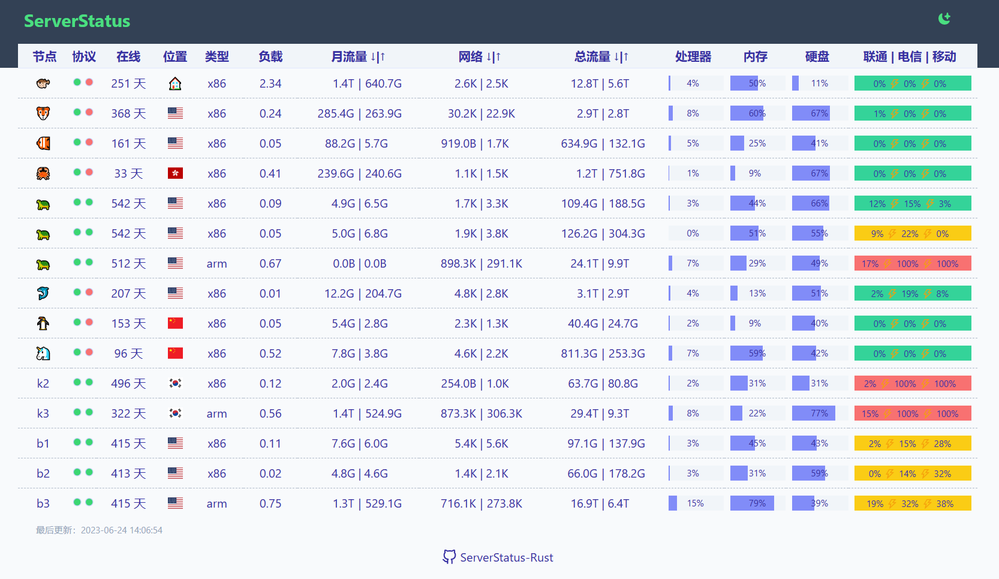

## 看板

### ServerStatus-Rust

> 多服务器监控
> 
> 项目地址：[zdz/ServerStatus-Rust: ✨ Rust 版 ServerStatus 探针、威力加强版 (github.com)](https://github.com/zdz/ServerStatus-Rust)
> 
> 在线地址：[ServerStatus (ssr.rs)](https://ssr.rs/)
> 
> 官方教程：[快速部署 - Rust 版 ServerStatus 云探针 (ssr.rs)](https://doc.ssr.rs/rapid_deploy/)
> 
> 搭建教程：[ServerStatus-Rust 服务器探针搭建使用全指南/保姆级教程 - 星笙月煜 (iocky.com)](https://iocky.com/archives/13/)

> 更多搭建教程：[https://blog.laoda.de/archives/ward-serverstatus-install](https://blog.laoda.de/archives/ward-serverstatus-install)

## 扩展

> AI决定：[https://eitherchoice.com/](https://eitherchoice.com/)

> 央企招聘平台：[https://cujiuye.iguopin.com/](https://cujiuye.iguopin.com/)

> 心理测试：[https://types.yuzeli.com/survey](https://types.yuzeli.com/survey)
> 
> 提供了各种类型的心理测试，比如心理健康测试、16型人格测试、趣味心理测试、职业规划测试……一个54个类别的心理测试

> chatgpt 1000次试用：[GPTDOS - GPT Disk Operating System](https://abb5-chat.gptdos.com/)
>

> 考试资源网：[http://daxuesheng123.ysepan.com/](http://daxuesheng123.ysepan.com/)
> 
> 各类资源共享：[https://dwz.date/fxmN](https://dwz.date/fxmN)
> 
> 游戏资源：[https://dwz.date/fxmP](https://dwz.date/fxmP)