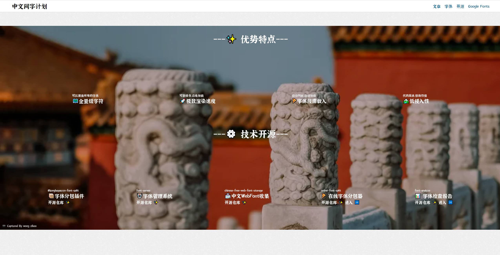
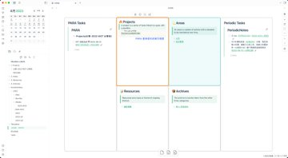

> 今麦郎 好水不硬才养人

## 工具

中文网字计划
> 在线地址：[https://chinese-font.netlify.app/](https://chinese-font.netlify.app/)
> 
> 「中文网字计划」，收录众多中文字体并通过 Web Font 的形式为网站开发者提供美丽字体，比如说你的博客或网站想引入霞鹜文楷这种好看的字体，很简单去复制 CDN 地址加到代码即可

> 1. 降低使用门槛，即为周期笔记和 PARA 的提供查询视图，将所有复杂的查询语句屏蔽； 
> 
> 2. 单一事实来源，用户只需要设置元信息，插件负责读取； 
> 
> 3. 关系图谱优化，即在 PARA 目录下支持 [http://XXX.README.md]() 作为索引，否则所有的节点都将是 README；

脚本
> 在线地址：[https://github.com/yeahwu/v2ray-wss](https://github.com/yeahwu/v2ray-wss)
> 
> reality 脚本偷的是这三个网址，也就是说这三个网址，
> 客户端可以任意切换：
>  [http://amazon.com](http://amazon.com)
>  
>  [http://addons.mozilla.org](http://addons.mozilla.org) 
>  
>  [http://tesla.com](http://tesla.com)

PAL2
> 在线地址：[https://www.hayo.com/entry/3137](https://www.hayo.com/entry/3137)
> 
> PaLM 2 是下一代大型语言模型，它建立在 Google 在机器学习和负责任的 AI 领域突破性研究的基础上。
	它[擅长](https://ai.google/static/documents/palm2techreport.pdf)高级推理任务，包括代码和数学、分类和问答、翻译和多语言能力以及自然语言生成，比我们之前最先进的法学硕士（包括 PaLM）更好。它之所以能够完成这些任务，是因为它的构建方式——将计算最优扩展、改进的数据集混合和模型架构改进结合在一起。

> RealChar——一个全能的开源代码库!
> @llama_index、@LangChainAI、@elevenlabsio、@trychroma、@openaiGPT3.5/4、@AnthropicAI Claude2

## 资料

> 在线地址：[书籍下载](http://pdfdrive.com)
> 
> 近7700万本书籍，包括期刊、杂志、指南等各种类型的书籍，并支持PDF、epub和mobi格式的下载

## 扩展

> 在线地址：[https://www.appinn.com/guxiang/](https://www.appinn.com/guxiang/)
> 
> 明日故乡：中国版数字游民指南，用 AI 来寻找有星巴克、麦当劳，全年雨天小于 60 天，最高气温低于 30 度的城市，目前包括 2206 个城市数据。

直播实时翻译插件：
> 直播翻译：[https://chrome.google.com/webstore/detail/felo-subtitles-chatgpt-li/ponokiofkijoolhebggofhhibnafebna?hl=zh-CN](https://chrome.google.com/webstore/detail/felo-subtitles-chatgpt-li/ponokiofkijoolhebggofhhibnafebna?hl=zh-CN)
> 
> 视频翻译：[https://chrome.google.com/webstore/detail/youtube-dual-subtitles/hkbdddpiemdeibjoknnofflfgbgnebcm/related](https://chrome.google.com/webstore/detail/youtube-dual-subtitles/hkbdddpiemdeibjoknnofflfgbgnebcm/related)
> YouTube视频还是直播，都能实时翻译

快速搭建博客
> 在线地址：[如何复刻本网站，零氪快速建博客](https://cali.so/blog/guide-for-cloning-my-site)

## 后端

mysql 的所有 buffer
> 在线地址：[https://heapdump.cn/article/4583227](https://heapdump.cn/article/4583227)
> 
> 总结 mysql 的所有 buffer

> 在线地址：[提问的智慧](https://github.com/ryanhanwu/How-To-Ask-Questions-The-Smart-Way/blob/main/README-zh_CN.md）
> 
> 《提问的智慧》，原文叫做 How To Ask Questions The Smart Way
> 

## 有趣的项目

> 项目地址：[https://github.com/unixzii/revue](https://github.com/unixzii/revue)
> 
> 一个把 React 组件丝滑桥接到 Vue 的小玩具