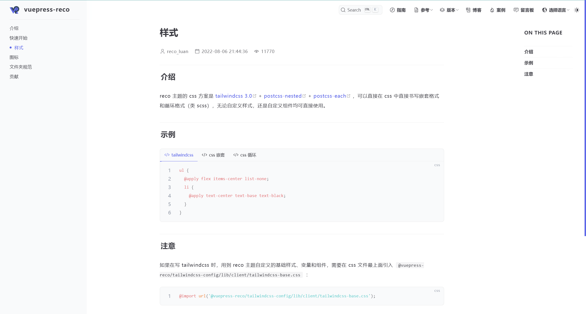
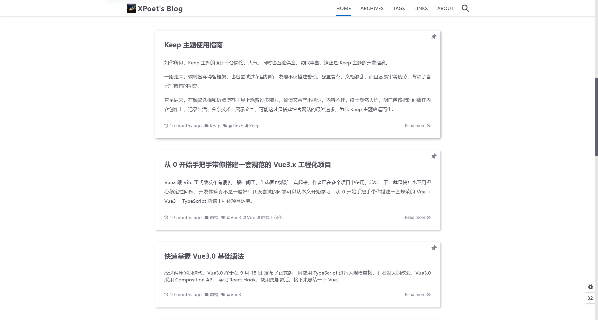
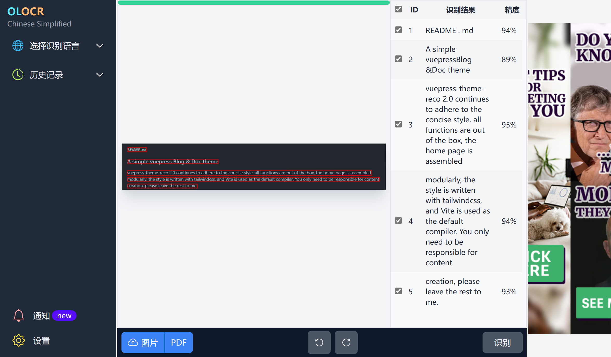
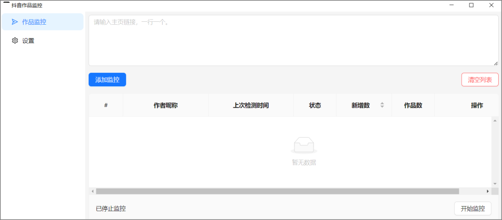
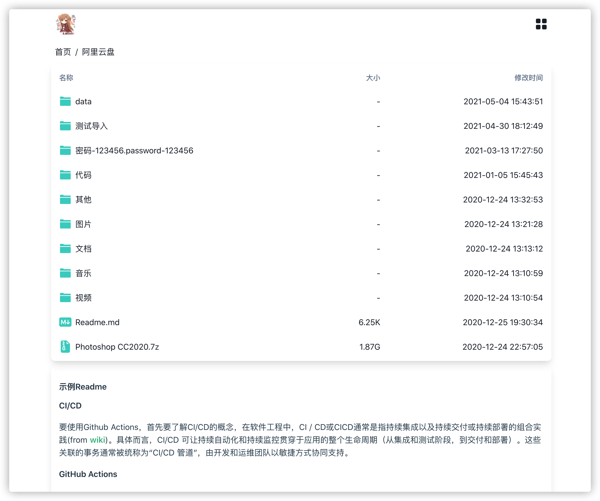
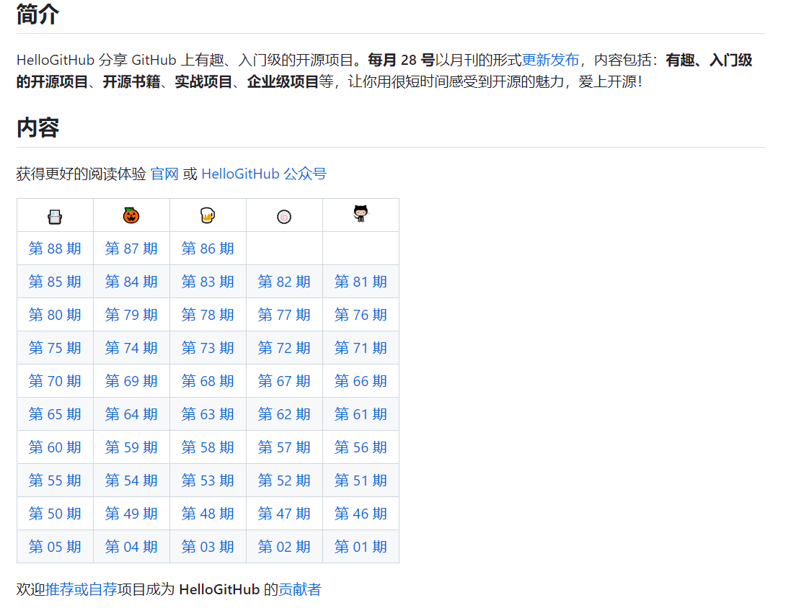
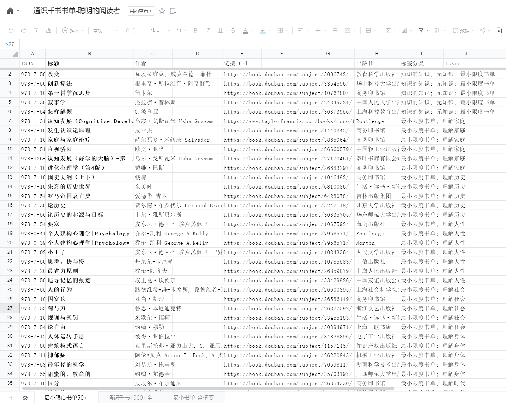

> 分享、实用、有趣、共勉

## 博客主题

vuepress-theme-reco
> 项目地址：[vuepress-reco/vuepress-theme-reco: 🎨 This is the repo for vuepress-theme-reco 2. (github.com)](https://github.com/vuepress-reco/vuepress-theme-reco)
>
> 在线地址：[vuepress-reco (recoluan.com)](https://vuepress-theme-reco.recoluan.com/)
>
> reco 主题的 css 方案是 [tailwindcss 3.0open in new window](https://tailwindcss.com/docs/installation) + [postcss-nestedopen in new window](https://github.com/postcss/postcss-nested) + [postcss-eachopen in new window](https://github.com/madyankin/postcss-each) ，可以直接在 css 中直接书写嵌套格式和循环格式（类 scss），无论自定义样式，还是自定义组件均可直接使用。
>
> 很适合写文档说明

hexo-theme-keep

> 项目地址：[XPoet/hexo-theme-keep: :rainbow: A simple and elegant theme for Hexo. It makes you more focused on writing. (github.com)](https://github.com/XPoet/hexo-theme-keep)
>
> 在线地址：[XPoet's Blog](https://xpoet.cn/)

hexo-theme-sakura

> 项目地址：[honjun/hexo-theme-sakura (github.com)](https://github.com/honjun/hexo-theme-sakura)
> 
> 在线地址：[hojun - 好少年光芒万丈](https://www.hojun.cn/)

## 工具推荐

贝贝BiliBili - B站视频下载
> 在线地址：[https://xbeibeix.com/api/bilibili/](https://xbeibeix.com/api/bilibili/)
> 
> 短视频下载：[贝贝短视频在线解析 - 抖音,快手,视频下载 (xbeibeix.com)](https://xbeibeix.com/api/tiktok/)

B站下载工具  

> 在线地址：[http://zhouql.vip/bilibili/](http://zhouql.vip/bilibili/)
> 
> 一个不错的极简小破站视频下载工具，界面很干净，不仅可以下载视频，还能获取弹幕、获取封面等。关键是还提供了一个桌面端的软件，可以在这个页面直接下载。

在线图片文字识别ocr  

> 在线地址：[https://olocr.com/zh-CN](https://olocr.com/zh-CN)
> 
> 一个很好用的轻量在线文字识别工具，支持图片和pdf的文字识别，而且支持多种语言。所有操作都在你本地浏览器中完成，保护隐私，如果临时有这方面的需求，可以试试，特别是pdf文档，非常方便。

某音作品监控

> 蓝奏：[https://ilaoygzs.lanzouj.com/ietxx14xg37a](https://ilaoygzs.lanzouj.com/ietxx14xg37a)
> 
> 微云：[https://share.weiyun.com/9hh8fY7L](https://share.weiyun.com/9hh8fY7L)
> 
> 很小的一个软件，功能也很单一，就是监控你所关注的某音up主是否更新了，可以根据自己需要合理设置自动监控时间

## 看世界

> 在线地址：[流动的硅谷：AI大潮、大厂探秘及华人国际化](https://mp.weixin.qq.com/s?__biz=Mzg5NDc5NDkzMA==&mid=2247483920&idx=1&sn=a3dd8e84a5c491fceace8a4bc889f4d7)

> 在线地址：[一些错过，几次创业，反思总结](https://zhuanlan.zhihu.com/p/112098729)
> 
> 背景： - 完美错过纳斯达克上市机会 - 错过中间件的巨大商业机会 - 移动 App 和 O2O 创业经历 - 做过培训，但没坚持 - 目前通过组织网络协作开发交付项目 - 专注编程写作、数学物理、机器人机器学习 - 创业首先赚钱，之后才是理想

再分享一下
Alist网盘共享工具：

>在线地址：[https://alist.nn.ci/zh/](https://alist.nn.ci/zh/)
>
>一个支持多种存储，支持网页浏览和 WebDAV 的文件列表程序，由 gin 和 Solidjs 驱动

## 扩展

> 项目地址：[https://github.com/bregman-arie/devops-exercises](https://github.com/bregman-arie/devops-exercises)
> 
> 一个和运维相关的很全知识库，包括 2624 个练习和问题，假如你想成为一名 DevOps 工程师，学习一些这里面的内容挺好的，包括 Linux，Jenkins，AWS，SRE，Prometheus，Docker，Python，Ansible，Git，Kubernetes，OpenStack，SQL，Azure，DNS 等知识。

> 项目地址：[https://github.com/521xueweihan/HelloGitHub](https://github.com/521xueweihan/HelloGitHub)
> 
> 每月28 号发布分享 GitHub 上有趣、入门级的开源项目。内容包括：有趣、入门级的开源项目、开源书籍、实战项目、企业级项目等。

> 在线地址：[https://docs.qq.com/sheet/DY2RmcVVMVE9Qd3JV?tab=BB08J2](https://docs.qq.com/sheet/DY2RmcVVMVE9Qd3JV?tab=BB08J2)
> 
> 通识类的书单整理，来自于「聪明的阅读者」，包括了各个领域的知识和理解，很简单使用网页 Excel 直接整理，其中也分成了最小 50 本，以及完整的 1000+ 书籍整理

