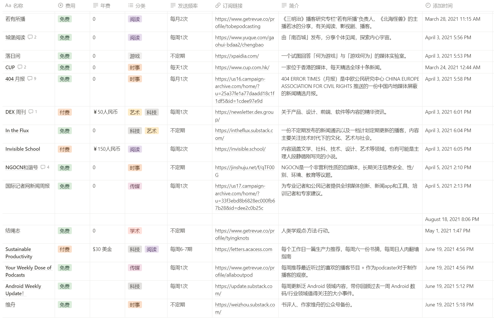

> 分享、实用、有趣、共勉

## 周刊

周刊博客：

> [阮一峰的网络日志 (ruanyifeng.com)](http://www.ruanyifeng.com/blog/)
> 
> [潮流周刊 (tw93.fun)](https://weekly.tw93.fun/)
> 
> [MDH 前端周刊 (yuque.com)](https://www.yuque.com/chencheng/mdh-weekly)
> 
> [HelloGitHub](https://hellogithub.com/)
> 
> [54321-Weekly](https://github.com/versun/54321-Weekly)
> 
> [Weekly](https://x.yct.ee/tag/Weekly)

## 工具

> 分享比较实用的工具，便于提高工作效率

### 一款跨平台的划词翻译软件

> 文档：[https://pot-app.com/docs/tutorial/intro](https://pot-app.com/docs/tutorial/intro)
> 
> 项目地址：[https://github.com/pot-app/pot-desktop](https://github.com/pot-app/pot-desktop)
> 
> 支持划词翻译、输入翻译、截图翻译等多种模式的翻译工具，适用于 Windows、macOS 和 Linux。

### 浏览器插件--沉浸式翻译

> 在线地址：[[沉浸式翻译 - 双语网页翻译扩展, 电子书翻译, PDF翻译, 字幕翻译 (immersivetranslate.com)](https://immersivetranslate.com/)]
> 
> 一键开启双语阅读，提升信息获取效率
> 
> 沉浸式翻译是一款浏览器插件，可以智能识别网页主内容区进行双语翻译，插件支持全平台浏览器，PDF文件翻译，EPUB电子书双语翻译、制作、导出，字幕文件翻译等功能。

### 快速搜索本地文件

> 在线地址：[https://www.voidtools.com/](https://www.voidtools.com/)
> 
> windows 平台的一款本地文件搜索引擎，具有轻量，快速，干净的特点 支持中文，让你快速检索本地文件

## 文档

飞书文档

> 在线地址：[[我的空间 - 飞书云文档 (feishu.cn)](https://ocxfa4l2ug.feishu.cn/drive/me/)]
> 
> 飞书文档是新一代高效协作工具，在线文档支持一键插入表格、图片、视频、文件，投票、代码块、任务列表，协同文档满足多场景创作需求。 更有多元化表格，数据表和看板形式，仪表盘等。
> 
> 个人觉得很好使用，也很容易上手使用。例如：待办事项、个人记账可视化等。

> 个人尝试过notion、语雀、石墨文档、FlowWs等，每个都有自己的优势和不足，最近尝试找一款可以降低成本、提高效率的管理工具，于是就再次重启使用飞书文档了，之前使用过，觉得太工作化了，但现在不这么觉得了，觉得很方便很适合我的需求。

notion
> 在线地址：[https://www.notion.so/zh-cn](https://www.notion.so/zh-cn)
> 
> **Notion**是一款将笔记、知识库和任务管理无缝整合的协作平台。它具有无限的层级和相互链接的组织弹性，给笔记间的关系提供了足够自由的组织方式；它排版灵活，能够把笔记里的内容按块（Block）进行组织和拖拽，甚至可以做出 Trello 看板进行项目管理；它的内容类型丰富，可以嵌入图片、网页、文档甚至视频，几乎无所不能。
> 
> 国内访问速度慢，体验不是那么好

## 扩展

浏览器输入 [1.1.1.1](1.1.1.1) 获取免费的科学网络姿势

> 不会使用的可以参考：[一个访问全球互联网的“备用机”](https://www.barryi.me/posts/CloudflareZeroTrust.html)
> 
> 视频教程：[warp连不上？一直连接中](https://www.youtube.com/watch?v=LNtSnbsONK0)

录制操作网页行为

> 谷歌浏览行为记录：[https://developer.chrome.com/docs/devtools/recorder/](https://developer.chrome.com/docs/devtools/recorder/)
> 
> 项目地址：[https://github.com/puppeteer/replay](https://github.com/puppeteer/replay)
> 
> 利用它可以将操作者在 Chrome 的行为路径 Record 下来，然后使用 Replay 进行浏览器层面的回放，记录包括页面跳转、内容输入、点击、鼠标移动等等。

chatgpt插件 5.4

> 在线地址：[https://three-recorder-52a.notion.site/chatgpt-5-4-34551fe088b04e38888d44a275aa22aa](https://three-recorder-52a.notion.site/chatgpt-5-4-34551fe088b04e38888d44a275aa22aa)

研报客官网
> 在线地址：[https://www.yanbaoke.com/index](https://www.yanbaoke.com/index)
> 
> 研报客官网（[www.yanbaoke.com](www.yanbaoke.com)）是一个提供全球智库研报、全行业研究报告、调查调研报告以及趋势前景深度报告的网站。该网站实时更新，并允许用户免费下载pdf、doc和ppt格式的报告。
> 
> 研报客官网的核心特色在于其提供的全面的研究报告服务：
> 
> 1.  提供全球智库研报，涵盖多个领域的专业研究。
> 2.  提供全行业研究报告，帮助用户了解各个行业的最新动态和发展趋势。
> 3.  提供调查调研报告，为用户提供深入的市场分析和数据。
> 4.  提供趋势前景深度报告，为用户提供行业的前瞻性分析。
> 5.  实时更新，确保用户能够获取到最新的研究资料。
> 6.  支持免费下载，用户可以方便地获取pdf、doc和ppt格式的报告。

中文 Newsletter 导航

> 在线地址：[https://www.notion.so/kfang/Newsletter-68ee46c0a4574f659fb8a873ead438c6](https://www.notion.so/kfang/Newsletter-68ee46c0a4574f659fb8a873ead438c6)
> 
> 包含了新闻、产品、科技、技术、阅读、教育、实事、艺术等

## Github推荐

> Github用户：
> [QuintGao](https://github.com/QuintGao)
> [imnxg](https://github.com/imnxg?tab=stars)
> [caro401?](https://github.com/caro401?tab=stars)
> [versun](https://github.com/versun?tab=stars)

